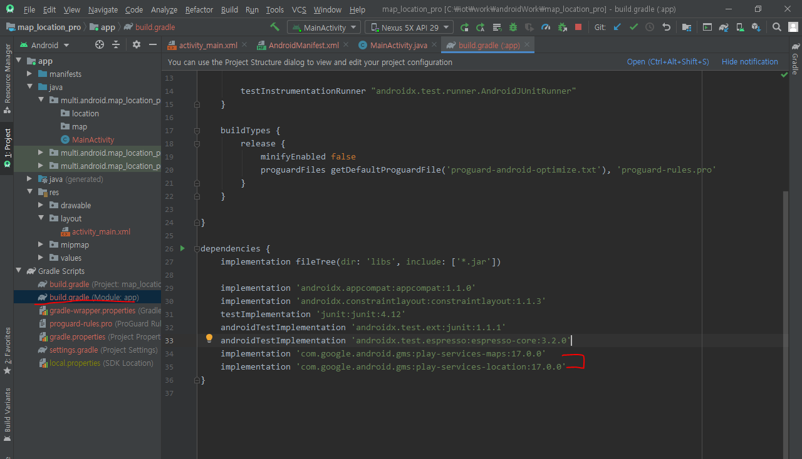

# 안드로이드 (Map)

https://console.developers.google.com/

SDK Manager


하이브리드 용 프레임워크

```java
androidTestImplementation 'androidx.test.espresso:espresso-core:3.2.0'
```


지도사용방법


1.    설치 작업

   

2. 유저 퍼미션 등록

```java
<uses-permission android:name="android.permission.INTERNET"/>
```

3. mata-data 등록 

- value - 라이브러리 키 등록


